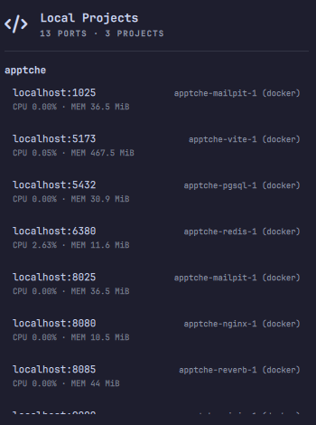

# Local Projects

An [Omarchy](https://omarchy.org/) shell bar-widget that lists everything
listening on `localhost`/`127.0.0.1`, grouped by the project folder it runs
from, with CPU/mem per port, one click to open it in the browser, and a
kill/stop button with confirmation.



## Why

If you run several projects at once — a couple of `docker compose` stacks, a
`vite`/`npm run dev` server here and there — this puts all of them in one
place instead of you having to remember which port is which, `docker ps`-ing
around, or hunting for the right terminal tab to `Ctrl+C`.

## Features

- **Two sources, one list**: plain processes (found via `ss -ltnp` +
  `/proc/<pid>/cwd`) and Docker Compose stacks (found via
  `com.docker.compose.project.working_dir` labels), grouped by the folder
  each one runs from.
- **Live CPU / memory** per port (`ps` for native processes, `docker stats`
  for containers).
- **Click / Enter** opens `http://localhost:<port>/` in your default browser.
- **Right-click / `x`** opens a confirmation dialog to kill it: a native
  process is signaled through a `pidfd` opened the moment you ask to kill it
  (not a bare PID sent later), so a PID reused by an unrelated process while
  the dialog was open can't be hit by mistake; a container is stopped by its
  immutable ID, not its (renamable) name — only that specific service, not
  the whole compose stack.
- Keyboard-first popup: `j`/`k` navigate, `Enter` open, `c` copy the URL,
  `r` refresh, `x`/right-click kill, `Esc` close.
- Refresh interval is configurable (`refreshMs`, default 5000ms).

## ⚠️ This plugin can kill things

Like every Omarchy shell plugin, this runs unsandboxed inside `omarchy-shell`.
Unlike most bar widgets (which only *read* state), this one can *stop*
processes and containers on your machine — with a confirmation dialog in the
way, but no password prompt. Only install it if you're comfortable with that,
and read `Model.js`/`Panel.qml` before you do (they're short).

## Requirements

- `ss` (iproute2) — present on virtually every Linux system.
- `python3` (3.9+, for `os.pidfd_open`/`signal.pidfd_send_signal`) — used
  only when you kill a native process; without it, killing a native process
  is a safe no-op instead of falling back to an unverified `kill <pid>`
  (stopping a Docker container doesn't need it).
- `docker` — optional; the Docker section just shows nothing if it's not
  installed or the daemon isn't reachable.
- `omarchy-launch-browser` and `wl-copy` — both ship with Omarchy.

## Install

```bash
omarchy plugin add https://github.com/gbflores/omarchy-local-projects.git --enable
```

Or by hand:

```bash
git clone https://github.com/gbflores/omarchy-local-projects.git \
  ~/.config/omarchy/plugins/io.github.gbflores.local-projects
omarchy-shell shell rescanPlugins
omarchy plugin enable io.github.gbflores.local-projects right
omarchy restart shell   # bar-widgets need a full shell restart to mount, not just a rescan
```

## Remove

```bash
omarchy plugin remove io.github.gbflores.local-projects
```

Or by hand:

```bash
omarchy plugin disable io.github.gbflores.local-projects
rm -rf ~/.config/omarchy/plugins/io.github.gbflores.local-projects
omarchy-shell shell rescanPlugins
```

## Known quirk

The "folder name" shown is the literal basename of wherever the project's
`docker-compose.yml` (or the native process's cwd) lives. If your compose
file sits in a `<project>/docker/docker-compose.yml` subfolder, the group
will show up as `docker` instead of `<project>` — that's the literal folder
name doing exactly what it says, not a bug, but worth knowing.

## License

MIT — see [LICENSE](LICENSE).
